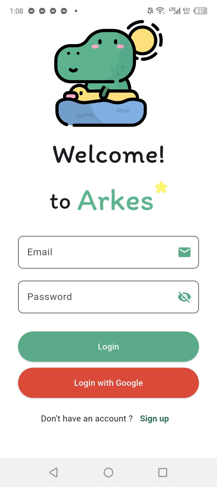
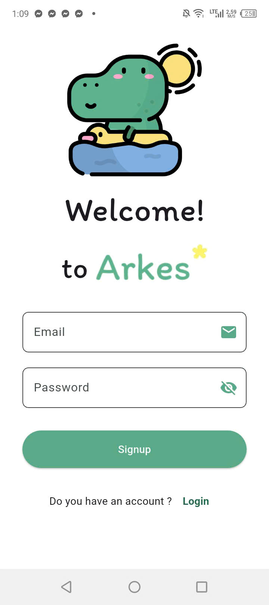
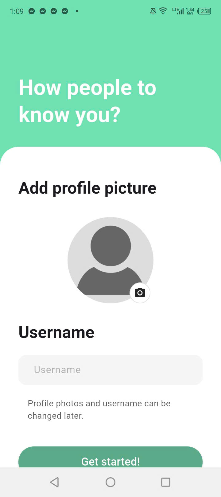
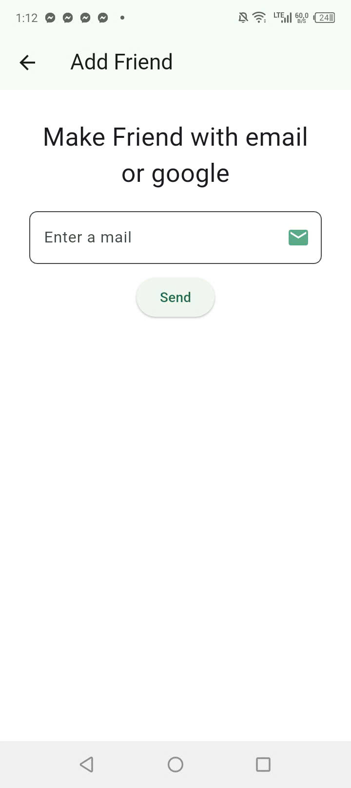
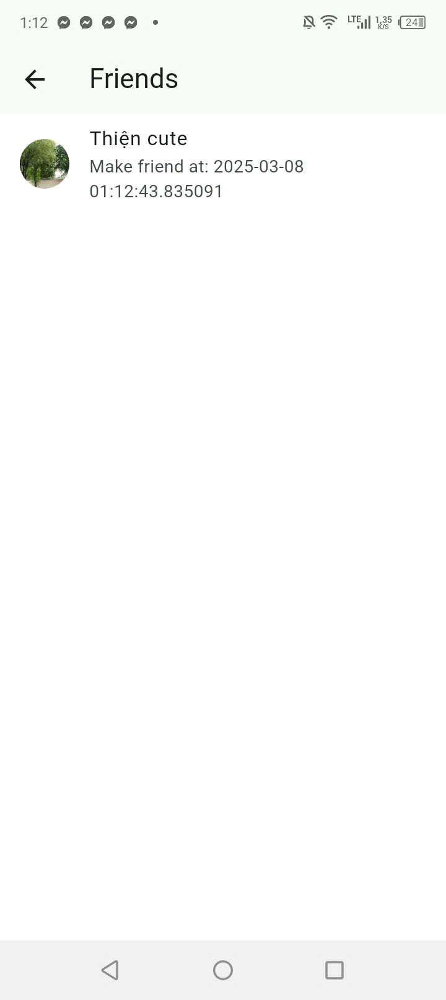
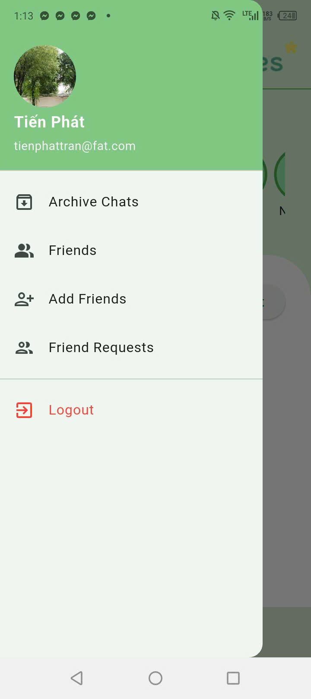
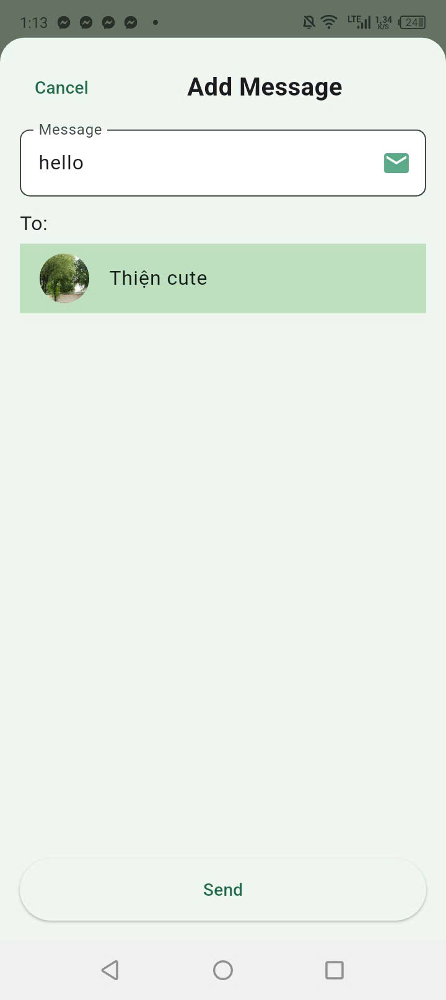
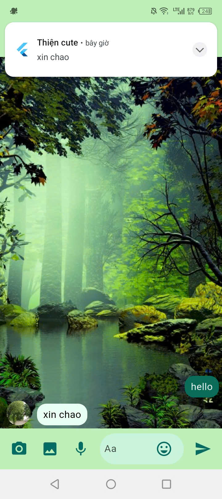

# 🗨️ Arkes Chat App

**Arkes Chat App** là một ứng dụng trò chuyện thời gian thực được xây dựng bằng **Flutter** và sử dụng **Firebase** làm backend. Ứng dụng hỗ trợ chat 1-1, gửi tin nhắn văn bản, thông báo đẩy, nhiều tính năng khác.

## 📸 Demo

**Màn hình Login**

**Màn hình Signup**

**Màn hình Update Profile**

**Màn hình Add Friend**

**Màn hình Danh Sách Friends**

**Màn hình Drawer**

**Màn hình Add Message**

**Màn hình Push Notification**

---

## Tính năng chính

✅ **Xác thực người dùng**: Đăng nhập, đăng ký, đăng xuất bằng email và Google.  
✅ **Chat 1-1**: Người dùng có thể trò chuyện riêng tư với nhau.  
✅ **Gửi tin nhắn văn bản**: Tin nhắn được hiển thị theo thời gian thực.  
✅ **Thông báo đẩy**: Nhận thông báo khi có tin nhắn mới.  
✅ **Danh sách bạn bè**: Hiển thị danh sách bạn bè của người dùng.  
✅ **Tìm kiếm bạn bè**: Tìm kiếm và gửi lời mời kết bạn.

---

## 🏗️ Công nghệ sử dụng

- **Frontend**: Flutter (Dart)
- **Backend**: Firebase (Firestore, Authentication, Firebase Storage, Firebase Messaging)
- **Thông báo đẩy**: Firebase Cloud Messaging (FCM)
- **Quản lý trạng thái**: Riverpod
- **Lưu trữ dữ liệu**: Firebase Firestore
- **Upload hình ảnh**: Firebase Storage
- **Giao diện người dùng**: Material Design

---
